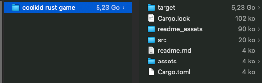

# Bevy, Rust, whatever you want

1. [What is the goal ?](#what-is-the-goal)
2. [What is Bevy ?](#what-is-bevy)
3. [Why I actually love Bevy ? (and why I hate it)](#why-i-actually-love-bevy-and-why-i-hate-it)
    1. [Bevy is cool and the name is cool.](#bevy-is-cool-and-the-name-is-cool)
    2. [Data Driven](#data-driven)
    3. [I hate Bevy. Bevy, I hate you.](#i-hate-bevy-bevy-i-hate-you)
    4. [Good 2D Renderer Bevy](#good-2d-renderer-bevy)
    5. [Why is my repo 5 go ?](#why-is-my-repo-5-go)
    6. [I hate composition in OOP, I prefer Inheritance.](#i-hate-composition-in-oop-i-prefer-inheritance)
    7. [The fckin Borrow Checking](#the-fckin-borrow-checking)
4. [What is inside this POC ?](#what-is-inside-this-poc)
5. [Very interesting resources](#very-interesting-resources)
    1. [Documentation about Game Engine](#documentation-about-game-engine)
    2. [Other cool things](#other-cool-things)
6. [Some tests I did](#some-tests-i-did)
    1. [Code Editor tests :p](#code-editor-tests-p)
        1. [Zed (cute but unusable in my case lol)](#zed-cute-but-unusable-in-my-case-lol)
        2. [VSCode](#vscode)
        3. [Rust Rover ❤️](#rust-rover-️)
7. [Conclusion](#conclusion)
    1. [Sources I used to make this repo](#sources-i-used-to-make-this-repo)

---

## What is the goal

Make something funny with Bevy and reusable. (like a Scene Manager)

---

## What is Bevy

Bevy is a little data driven game engine made in Rust, for more information : https://bevyengine.org/

---

## Why i actually love Bevy (and why i hate it)

### Bevy is cool and the name is cool.

Bevy is a cool game engine, why ? cause it is made in rust, why is it cool ? because I want to learn rust. Why ? Idk let me have fun.

### Data Driven

I have always heard about data driven structures without really understanding, now I understand a little, but not too much either.

I think the data driven mentality behind Bevy is pretty fun and interesting, unfortunately I don't use the [ECS](https://docs.rs/bevy_ecs/latest/bevy_ecs/) logic in this example (I don't really have the level to use it in a proper way for this POC, but I still can do pretty funny things with the basic feature of this Game Engine)

### I hate Bevy. Bevy, i hate you.

I also hate Bevy, because there have been a lot of changes in a short time, making some forum discussions obsolete (for example, the answer of this [GH discussion](https://github.com/bevyengine/bevy/discussions/4017) is obsolete and made me cry), but that's also why I like Bevy, because it's not dead.

### Good 2D Renderer Bevy

There is a good 2D Renderer in it, yes it's a normal point for a lot of game engine but when I dug deep into game engine, it was complicated to find a good game engine with a simple and understandable 2D graphics API.

### Why is my repo 5 go

And ofc, i hate a little bit rust for this :

(i have a 256gb macbook lol..)

### I hate composition in OOP, I prefer Inheritance.

Knowing that Rust favors a composition system rather than inheritance, it was a little complicated to do OOP with Bevy, but I arrived at something that was somewhat correct and that I wanted, which is a little stupid but which can be reused and practical in the future. (Composition is also something i hate in this language.)

### The fckin Borrow Checking

Borrow checking killed all the fun I had in me when I started this repo, why ? because I don't have enough neurons to understand what lifetime is. 

---

## What is inside this POC
(actually)

- Example of how to use `bevy_pixel_camera` easily
- Example of how we can spawn a sprite
- A test of how to implement a "Scene Manager" in Bevy (even if it is a little bit messy)
- A test of how we can use the composition API to make a basic struct 
- A little test of UI in Bevy

---
## Very interesting resources

### Documentation about Game Engine

- This hero : [PhaetusFox](https://www.youtube.com/@PhaestusFox)
- For rendering sprite sheet : [example](https://bevyengine.org/examples-webgpu/2D%20Rendering/sprite-sheet/)
- For embed assets : [example](https://bevyengine.org/examples/Assets/embedded-asset/)

### Other cool things

- For hot reload : [plugin](https://github.com/lee-orr/dexterous_developer)
- For debug text overlay : [plugin](https://crates.io/crates/bevy_debug_text_overlay)

---
## Some tests i did

### Code Editor tests :p

- #### Zed (cute but unusable in my case lol)

I didn't really like Zed, it was fast & and I love the UI but some of my preferred shortcut doesn't work at all (i'm not in vim mode) ??? like ctrl + ` for open the terminal doesn't wan't to work for some reason, and some other shortcuts don't work as expected (cmd + b doesn't focus folder on the left if it is open and you are editing text), so I need to take my mouse and it just brainfuck me every time, etc... But I really liked the simple UI, I would probably use it again in 6 months when it will be a little more usable.

There is also some problem with the auto-completion which at times simply decides to no longer work...

To be more precise, this is my life before and after Zed : 

So i don't recommend it and i just don't understand the fck why everyone is talking about this actually saying it already killed vscode (and i can't use it on my arch)

- #### VSCode

I love VSCode but, I don't want to take 20 min to configure it too, so I didn't test it, but I think it can be a pretty good solution if we want to dev in Rust cause of its versatility and large ecosystems of plugins.

- #### Rust Rover ❤️

My preferred one, just install it, launch it, it works. Good autocompletion, shortcuts works (and ofc you can set differents keymaps with plugins), good. Slower than zed ofc but shortcuts works at least. Thanks JetBrain to make such cool things for poor students.

---

## Conclusion

It's a big failure, there is no feature reusable in this repo, but only documentation about how to understand my pain.

Rust is a pretty catchy language that makes me want to keep using it, although lifetime management is a bit scary (and is sometimes more complicated than just managing memory if we are beginner), that doesn't make it any less of a good language.

#### Sources I used to make this repo
- [...borrowchecker](https://www.youtube.com/watch?v=Nuba5LNy5cY)
- [borrowchecking, again =)](https://www.youtube.com/watch?v=t677JL4naXA)
- [did I tell you about borrow checking?](https://www.youtube.com/watch?v=1NJ-sFA4lMI&pp=ygUgYm9ycm93IGNoZWNraW5nIHJ1c3QgZXhwbGljYWl0b24%3D)
- [interest thing about mutable borrow (kill me)](https://users.rust-lang.org/t/second-mutable-borrow-why-does-it-occur-here/94485/4)
- [life time in rust](https://web.mit.edu/rust-lang_v1.25/arch/amd64_ubuntu1404/share/doc/rust/html/book/second-edition/ch19-02-advanced-lifetimes.html)
- [borrow checker again but in 60 seconds](https://www.youtube.com/watch?v=XSgQflmXqGo&t=0s)
- [oop in rust](https://jimskapt.github.io/rust-book-fr/ch17-00-oop.html)
- [very good ressources for everything (including borrow checking)](https://bevy-cheatbook.github.io/introduction.html)

and ofc there is a ton of stack overflow questions I checked but we don't care about that lol.

So in conclusion, I think I'll be able to flirt with girls a lot more easily now that I understand the principle of the borrow checker.