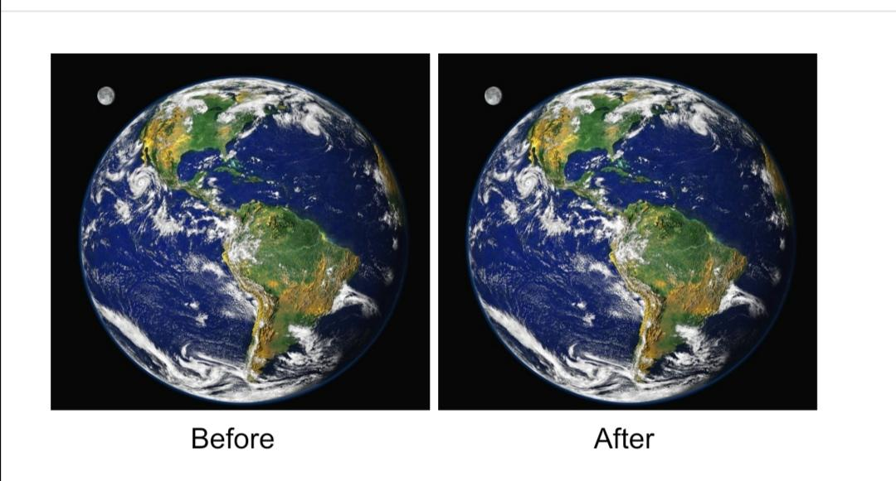

# Bevy POC

---

## What is Bevy ?

Bevy is a little data driven game engine made in Rust, for more information : https://bevyengine.org/

---

## Why i actually love Bevy ? (and why i hate it)

Bevy is a cool game engine, why ? cause it is made in rust, why is it cool ? because I want to learn rust. Why ? Idk let me have fun.

I think the data driven mentality behind Bevy is pretty fun and interesting, unfortunately I don't use the [ECS](https://docs.rs/bevy_ecs/latest/bevy_ecs/) logic in this example (I don't really have the level to use it in a proper way for this POC, but I still can do pretty funny things with the basic feature of this Game Engine)

I also hate Bevy, because there have been a lot of changes in a short time, making some forum discussions obsolete (for example, the answer of this [GH discussion](https://github.com/bevyengine/bevy/discussions/4017) is obsolete and made me cry), but that's also why I like Bevy, because it's not dead.

There is a good 2D Renderer in it, yes it's a normal point for a lot of game engine but when I dug deep into game engine, it was complicated to find a good game engine with a simple and understandable 2D graphics API.

And ofc, i hate a little bit rust for this :

(i have a 256gb macbook lol..)

---

## What is inside this POC ?
(actually)

- Example of how to use `bevy_pixel_camera` easily
- Example of how we can spawn a sprite

---
## Very interesting resources

### Documentation about Game Engine

- This hero : [PhaetusFox](https://www.youtube.com/@PhaestusFox)
- For rendering sprite sheet : [example](https://bevyengine.org/examples-webgpu/2D%20Rendering/sprite-sheet/)
- For embed assets : [example](https://bevyengine.org/examples/Assets/embedded-asset/)

### Other cool things

- For hot reload : [plugin](https://github.com/lee-orr/dexterous_developer)
- For debug text overlay : [plugin](https://crates.io/crates/bevy_debug_text_overlay)

---
## Some tests i did

### Code Editor tests :p

- #### Zed (cute but unusable in my case lol)

I didn't really like Zed, it was fast & and I love the UI but some of my preferred shortcut doesn't work at all (i'm not in vim mode) ??? like ctrl + ` for open the terminal doesn't wan't to work for some reason, and some other shortcuts don't work as expected (cmd + b doesn't focus folder on the left if it is open and you are editing text), so I need to take my mouse and it just brainfuck me every time, etc... But I really liked the simple UI, I would probably use it again in 6 months when it will be a little more usable.

There is also some problem with the auto-completion which at times simply decides to no longer work...

To be more precise, this is my life before and after Zed : 

So i don't recommend it and i just don't understand the fck why everyone is talking about this actually saying it already killed vscode (and i can't use it on my arch)

- #### VSCode

I love VSCode but, I don't want to take 20 min to configure it too, so I didn't test it, but I think it can be a pretty good solution if we want to dev in Rust cause of its versatility and large ecosystems of plugins.

- #### Rust Rover ❤️

My preferred one, just install it, launch it, it works. Good autocompletion, shortcuts works (and ofc you can set differents keymaps with plugins), good. Slower than zed ofc but it shortcuts works at least. Thanks JetBrain to make such cool things for poor students.